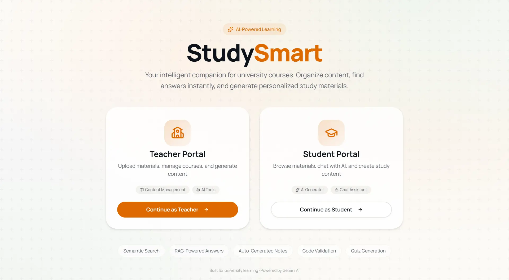

# StudySmart

**AI-powered supplementary learning platform for university courses.**




[Overview](#overview) • [Features](#features) • [Architecture](#architecture) • [Quick Start](#quick-start) • [API Reference](#api-reference)

Repository: `https://github.com/bokaif/studysmart`

## Overview

StudySmart is a full-stack system for managing course materials and turning them into grounded AI learning workflows. It supports both **Theory** and **Lab** content, with role-based teacher/student experiences.

Core flow:

1. Teachers upload materials.
2. Backend indexes content for semantic and syntax-aware retrieval.
3. Students and teachers query via chat/search/generation.
4. Responses stay grounded in uploaded course data.

## Features

### Problem statement coverage

- **Content Management (Part 1):** upload, categorize, and browse materials by course/category/topic/week/tags.
- **Intelligent Search (Part 2):** semantic retrieval with optional syntax-aware code retrieval.
- **AI Learning Material Generation (Part 3):** generate readings, slides, PDFs, visuals, and code-oriented outputs.
- **Validation (Part 4):** generated code validation endpoint and clean output pipeline.
- **Conversational Interface (Part 5):** chat with context, citation links, and optional web search toggle.

### Additional functionality implemented

- Handwritten note digitization to structured Markdown/LaTeX + downloadable PDF.
- Forum with threaded replies and background AI assistant responses.
- Teacher analytics dashboard with materials/courses/student counts, AI usage trends, forum open/answered metrics, and student engagement leaderboard.
- Role-based onboarding and access control with Firebase auth.

> [!NOTE]
> Upload, edit, delete, reindex, and analytics routes are teacher-gated in the backend.

## Architecture


| Layer                | Stack                                      | Responsibilities                                                        |
| -------------------- | ------------------------------------------ | ----------------------------------------------------------------------- |
| Frontend             | Next.js 16, React 19, TypeScript, Tailwind | Role-based dashboards, chat UI, upload/search/generate/digitize flows   |
| Backend API          | FastAPI                                    | Material ingestion, retrieval, generation, validation, forum, analytics |
| Retrieval            | LlamaIndex + ChromaDB                      | Theory/Lab indexing and semantic search                                 |
| Code-aware retrieval | CodeSplitter + structural parsing          | Better chunk quality for code docs and syntax-aware matching            |
| Auth/Data            | Firebase Auth + Firestore                  | Identity, roles, metadata, forum, analytics events                      |
| Model provider       | Google Gemini                              | Chat, generation, and handwriting digitization                          |


## Project Structure

```text
studysmart/
├─ frontend/                   # Next.js app (teacher + student portals)
│  └─ src/app/                 # Route-based pages
├─ backend/                    # FastAPI backend
│  ├─ main.py                  # Core API + RAG/generation pipeline
│  ├─ forum.py                 # Forum routes
│  ├─ analytics.py             # Teacher analytics routes
│  ├─ auth.py                  # Firebase token + role dependencies
│  ├─ firestore_repo.py        # Firestore data access layer
│  ├─ uploads/                 # Uploaded/generated files (runtime)
│  └─ chroma_db/               # Vector store (runtime)
└─ README.md
```

## Quick Start

### Prerequisites

- Node.js `>= 18`
- Python `>= 3.10`
- Firebase project (Auth + Firestore)
- Gemini API key
- Firebase Admin service account JSON

> [!IMPORTANT]
> Backend startup requires a Firebase Admin JSON key file. By default, backend expects:
> `backend/.secrets/firebase-admin.json`

### 1. Clone and enter repo

```bash
git clone https://github.com/bokaif/studysmart.git
cd studysmart
```

### 2. Backend setup

```bash
cd backend
```

Create `.env` from sample:

```bash
# PowerShell
Copy-Item .env.example .env
```

Install dependencies (recommended):

```bash
uv sync
```

Fallback:

```bash
pip install -r requirements.txt
```

Run backend:

```bash
python main.py
```

Backend runs at `http://localhost:8000`.

### 3. Frontend setup

```bash
cd ../frontend
npm install
```

Create `frontend/.env.local` and set values (see env table below), then run:

```bash
npm run dev
```

Frontend runs at `http://localhost:3000`.

### 4. First-run checklist

1. Sign in with Google.
2. Pick `teacher` or `student` role.
3. As teacher, upload a few theory/lab files.
4. Use Search/Chat/Generator pages to verify grounded retrieval.

## Environment Variables

### Backend (`backend/.env`)


| Variable                         | Required | Description                                                                      |
| -------------------------------- | -------- | -------------------------------------------------------------------------------- |
| `GEMINI_API_KEY`                 | Yes      | Gemini API key for chat/generation/digitization                                  |
| `GOOGLE_API_KEY`                 | Optional | Alternate key name supported by backend                                          |
| `FIREBASE_PROJECT_ID`            | Yes      | Firestore project ID                                                             |
| `GOOGLE_APPLICATION_CREDENTIALS` | Optional | Path to Firebase Admin JSON (defaults to `backend/.secrets/firebase-admin.json`) |
| `host`                           | Optional | Backend host (default sample: `127.0.0.1`)                                       |
| `port`                           | Optional | Backend port (default sample: `8000`)                                            |


### Frontend (`frontend/.env.local`)


| Variable                                            | Required |
| --------------------------------------------------- | -------- |
| `NEXT_PUBLIC_API_URL` (`http://localhost:8000/api`) | Yes      |
| `NEXT_PUBLIC_FIREBASE_API_KEY`                      | Yes      |
| `NEXT_PUBLIC_FIREBASE_AUTH_DOMAIN`                  | Yes      |
| `NEXT_PUBLIC_FIREBASE_PROJECT_ID`                   | Yes      |
| `NEXT_PUBLIC_FIREBASE_STORAGE_BUCKET`               | Yes      |
| `NEXT_PUBLIC_FIREBASE_MESSAGING_SENDER_ID`          | Yes      |
| `NEXT_PUBLIC_FIREBASE_APP_ID`                       | Yes      |


## API Reference

### Core


| Method   | Route                      | Purpose                         | Auth          |
| -------- | -------------------------- | ------------------------------- | ------------- |
| `POST`   | `/api/upload`              | Upload + index material         | Teacher       |
| `POST`   | `/api/validate`            | Validate generated code         | Open          |
| `GET`    | `/api/courses`             | List distinct courses           | Open          |
| `GET`    | `/api/materials`           | List material metadata          | Open          |
| `PUT`    | `/api/materials/{file_id}` | Update material metadata        | Teacher       |
| `DELETE` | `/api/materials/{file_id}` | Delete material + index entry   | Teacher       |
| `POST`   | `/api/admin/reindex`       | Rebuild vector index            | Teacher       |
| `POST`   | `/api/search`              | Semantic/syntax-aware retrieval | Open          |
| `POST`   | `/api/chat`                | Grounded chat endpoint          | Optional user |
| `POST`   | `/api/generate`            | Generate study materials        | Optional user |
| `POST`   | `/api/digitize`            | Handwritten note digitization   | Optional user |
| `GET`    | `/download/{filename}`     | Download generated file         | Open          |


### Forum


| Method | Route                              | Purpose                |
| ------ | ---------------------------------- | ---------------------- |
| `GET`  | `/api/forum/posts`                 | List posts             |
| `GET`  | `/api/forum/posts/{post_id}`       | Post details + replies |
| `POST` | `/api/forum/posts`                 | Create post            |
| `POST` | `/api/forum/posts/{post_id}/reply` | Add reply              |


### Analytics


| Method | Route                     | Purpose                    | Auth    |
| ------ | ------------------------- | -------------------------- | ------- |
| `GET`  | `/api/analytics/teacher`  | Dashboard overview metrics | Teacher |
| `GET`  | `/api/analytics/students` | Student engagement stats   | Teacher |


## Technical Notes

- Two retrieval paths are used:
  - **Theory:** semantic chunking + vector retrieval.
  - **Lab/code:** `CodeSplitter` + structural context (functions/classes/imports) for more relevant code matches.
- Generated assets are served from `/static/materials` (backed by `backend/uploads`).
- Analytics uses short TTL caching and event aggregation to reduce repeated Firestore load during dashboard polling.

> [!TIP]  
> Keep a representative mix of theory slides/PDFs and lab code files in uploads. Retrieval quality improves significantly when both corpora are present.

## 🎓 BUET CSE Fest 2026 Hackathon

This project was built for **BUET CSE Fest 2026 Hackathon** to solve a real learning problem in university courses: scattered theory and lab content, weak searchability, and slow study-material creation. Goal: make course learning faster, grounded, and more usable for both students and teachers.

### Impact

- **Saves Time:** instant semantic search + grounded chat over uploaded course content
- **Improves Learning Access:** structured notes/slides/PDF generation from same course corpus
- **Enhances Lab Practice:** code-aware retrieval with `CodeSplitter` and structural parsing
- **Scalable Design:** role-based workflow that can be reused across multiple courses


## Team

- [@bokaif](https://github.com/bokaif)
- [@sinhasebur](https://github.com/sinhasebur)
- [@Avraaaa](https://github.com/Avraaaa)
